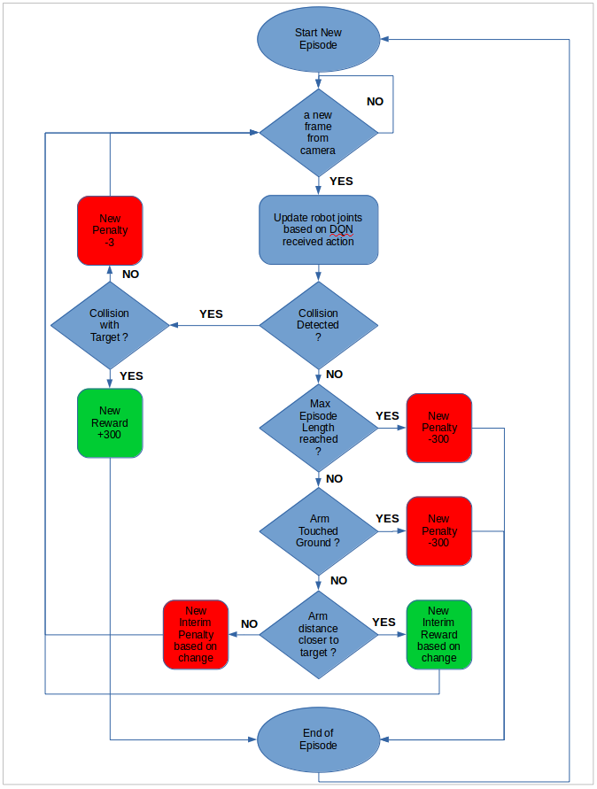
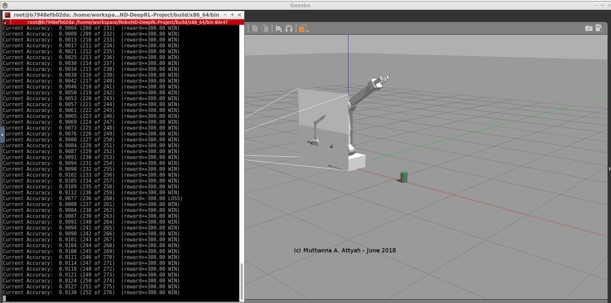

# Deep RL Arm Manipulation project
### Muthanna A. Attyah
### May, 2018

## Introduction

The goal of the project is to create a DQN agent and define a reward system to teach a robotic arm to carry out two primary objectives:

* Have any part of the robot arm touch the object of interest, with at least a **90%** accuracy.
* Have only the gripper base of the robot arm touch the object, with at least a **80%** accuracy.

The project will be done using Gazebo simulated environment with a C++ plug-in to interface Gazebo Simulated Robot to the DQN agent. in order to achieve the objective few tasks are required to be completed:

- Subscribe to camera and collision topics published by Gazebo.
- Create the DQN Agent and pass all required  parameters to it.
- Define position based control function for arm joints.
- Penalize robot gripper hitting the ground.
- Interim Reward/Penalize based on the arm distance to the object.
- Reward based on collision between the arm and the object.
- Tuning the hyperparameters.
- Reward based on collision between the arm’s gripper base and the object.

Next sections will explain in details how the required tasks were achieved.

## Reward Function

Deep Q-Network (DQN) output is usually mapped to a particular action, which, for this project, is the control of each joint for the simulated robotic arm. Control of the joint movements can be through velocity, position, or a mix of both. In case of this project position control approach was selected.

Reward system was designed to train the robot to have any part of the robot arm touch the object of interest in one attempt then have the gripper base of the robot arm touch the object in a second attempt. designed reward system is as described in below \ref{fig:1}. Each episode is limited to a certain number of attempts, penalty will be issued if maximum length of the episode was reached without winning. a penalty will be issued and episode will be ended if robot arm touched ground. interim reward or interim penalty will be issued while robot arm is moving based on the distance from the object of interest. when collision happens with object a win reward is issued and episode is ended.

### Reward System flowchart

  

Interim rewards are issued based on a smoothed moving average of the delta of the distance from the robot arm/gripper to the object of interest. It is calculated as following:

**Distance Delta = last Distance to Goal - Current Distanced to Goal**

**Average Goal Delta = (Average Goal Delta * alpha) + (distance Delta * (1.0 - alpha))**

Then interim reward is calculated based on the Average Goal Delta.

## Hyper-parameters

Following parameters were adjusted before it was possible to get any good results from the DQN agent.

\begin{itemize}
\item \textbf{INPUT\_WIDTH x INPUT\_HEIGHT} : every camera frame, at every simulation iteration, is fed into the DQN agent then the agent makes a prediction and carries out an appropriate action. Size of the input or the dimension of the camera frame is decided by these two parameters. Bigger frame size will require both more memory and more computing power. 512x512 did not work well for example and caused memory related errors. 64x64 was fine and it did not cause issues or negative impact on accuracy.\newline
\item \textbf{NUM\_ACTIONS} : based on the particular application, number of actions should be decided, in case of this project there are two actions per robot joint (increase or decrease either the joint velocity or the joint position), total number of joints is DOF (degrees of freedom) so the total number of actions for the robot will be 2 x DOF = 6. \newline
\item \textbf{OPTIMIZER} : There are many variations of stochastic gradient descent: Adam, RMSProp, Adagrad, etc. All let you set the learning rate. in this project RMSProp and Adam were tested and it produced similar results.\newline
\item \textbf{LEARNING\_RATE} : This parameter tells the optimizer how far to move the weights in the direction of the gradient for a batch. If the learning rate is low, then training is more reliable, but optimization will take a lot of time because steps towards the minimum of the loss function are tiny. If the learning rate is high, then training may not converge or even diverge. Weight changes can be so big that the optimizer overshoots the minimum and makes the loss worse. 0.3 was worse than 0.2, 0.1 was too slow to converge.\newline
\item \textbf{REPLAY\_MEMORY} : A cyclic buffer that stores the transitions that the DQN agent observes for later reuse by sampling from it randomly. the transitions that build up a batch are decorrelated. It has been shown that this greatly stabilizes and improves the DQN training procedure.\newline
\item \textbf{BATCH\_SIZE} : batch size * number of iterations = number of training examples, the bigger batch size the less number of iterations will be required but it will mean more memory and computing is required.\newline
\item \textbf{USE\_LSTM} : Enabling the (long Short Term Memory LSTM) as part of DQN network will allow training the network by taking into consideration multiple past frames from the camera sensor instead of a single frame. This will much improve the accuracy of learning\newline
\item \textbf{LSTM\_SIZE} : Size of each LSTM cell, the bigger the size the more computing power will be required.\newline
\end{itemize}

Following reward related parameters were also adjusted to fine tune the rewarding system:

* **REWARD_WIN** : number of points that will be issued in case of a successful arm/gripper touching the object of interest.

* **REWARD_LOSS** : number of points that will be panelized in case robot touched the ground or exceeded the allowed number of iterations per episode.

* **REWARD_MULT** : multiplier used to control the amount of points given in each interim reward or penalty based in distance from object of interest.

* **alpha** : smoothing factor to control average distance.

## Results

Before fine tuning the hyper-parameters and setting the right reward system; DQN network was taking longer time to reach the objective, accuracy was very low, and in many cases system was stopping with memory related errors. However after the fine tuning as described in above section it was possible to cross 92% accuracy within less than 300 cycles and the accuracy was still increasing. The same great performance was achievable in every run which confirms that system was well tuned and stable as shown in figures 2 & 3.

### Results of Robot Arm touching the object

  

During the test once the final tuned parameters were set, there was no need to re-tune the parameters after changing the objective from "arm touching the object" to "gripper base touching the object". DQN performance was excellent and stable to handle both cases.

### Results of Robot Grip touching the object

  

## Future Work

After fine tuning the hyper-parameters results was quite encouraging, however still there is a room for improvement. One suggest approach is to graph the accuracy progress for every change in parameters then identify the maximum accuracy that can be achieved and how many iterations (learning time) it will take to reach it.

DQN can be also used by itself to fine tune some of the parameters of another DQN where reward can be issued to the first DQN based on obtained accuracy from the second DQN.

Briefly discuss how you can improve your current results. Student should discuss on what approaches they could take to improve their results.
